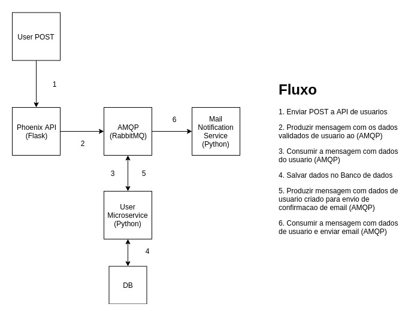

# Liftit Teste

Liftit Teste

# Como Testar a Aplicação

    - docker-compose -f docker-compose.test.yaml up
    - docker-compose -f docker-compose.test.yaml down

# Como Executar o Projeto

    - docker-compose up
    - Acessar o swagger em http://localhost:5000/

# Tecnologias Utilizadas

    - Python
    - Flask, FlaskRestplus
    - RabbitMQ
    - Docker
    - Docker-compose

# Fluxo da Aplicação

